# 📸 系统实现界面截图说明

所有截图已保存到 `docs/screenshots/` 目录下。

---

## 6.1 核心学习模块（成员A）

### 6.1.1 词库中心界面
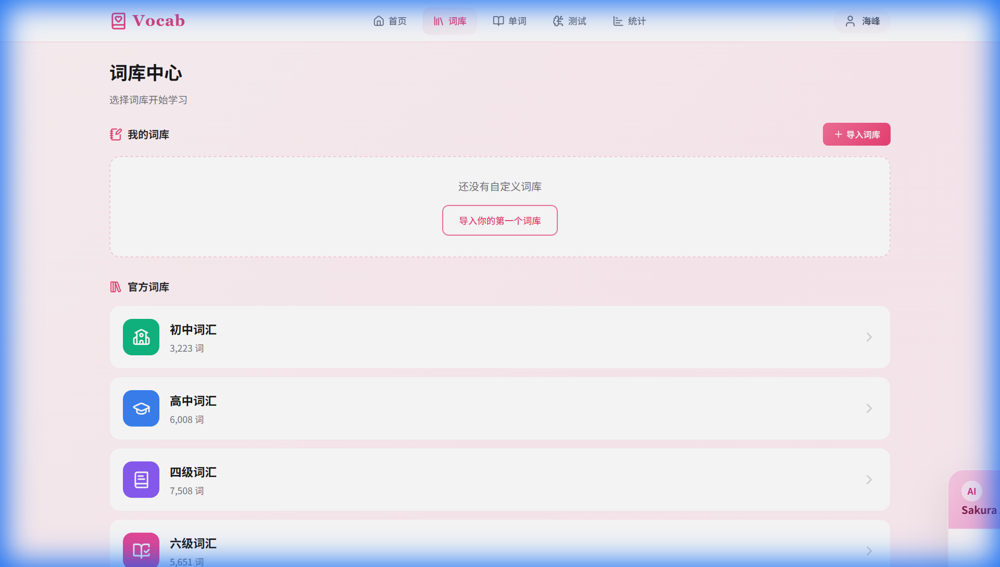

**说明**：词库中心展示了系统内置的多个词库，包括初中词汇、高中词汇、四级核心词汇、六级核心词汇、考研核心词汇等。用户可以选择需要学习的词库进行导入。

### 6.1.2 生词本 - 卡片视图
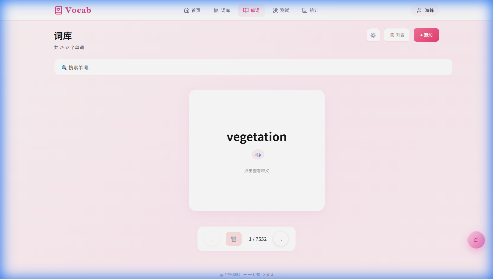

**说明**：生词本的卡片视图模式，以翻转卡片的形式展示单词，正面显示英文单词，点击可翻转查看中文释义。支持发音功能和删除操作。

### 6.1.3 生词本 - 列表视图
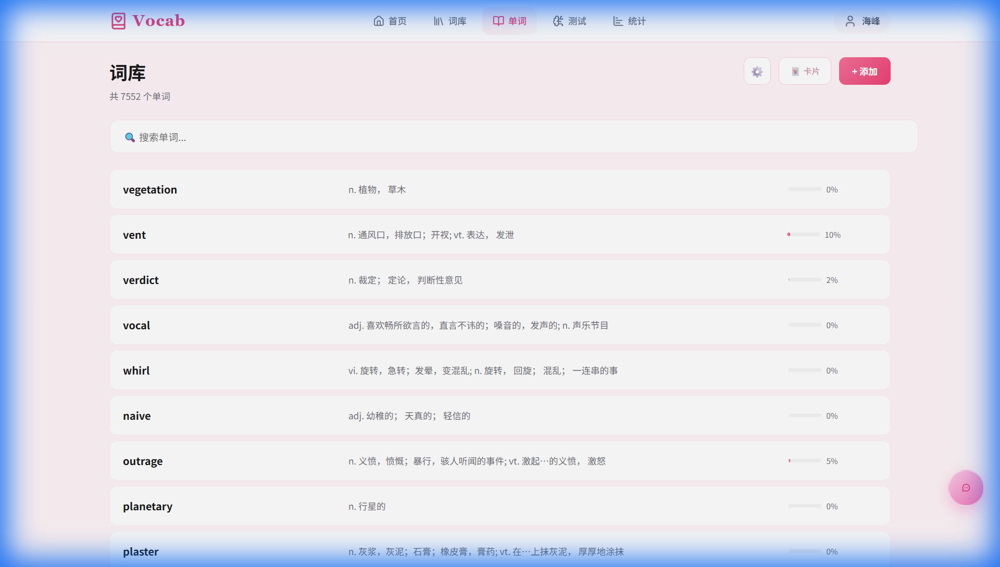

**说明**：生词本的列表视图模式，以表格形式展示所有已添加的单词，包含单词、释义、发音按钮和删除按钮，便于快速浏览和管理。

### 6.1.4 添加单词界面
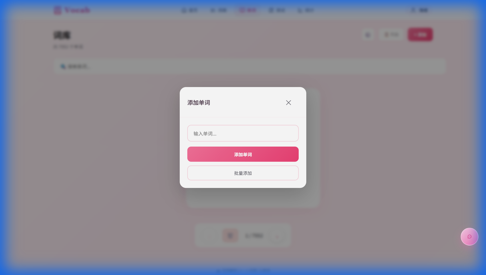

**说明**：单词添加弹窗界面，用户输入单词后可自动获取释义、发音和例句。支持手动编辑和自定义。

### 6.1.5 批量添加单词界面
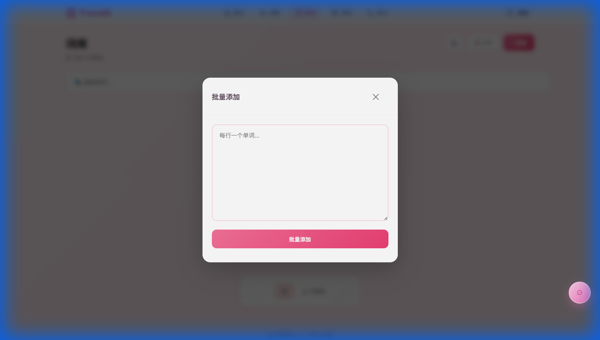

**说明**：批量添加单词界面，用户可以一次性输入多个单词（每行一个），系统会自动查询并添加到生词本中。

### 6.1.6 学习页面
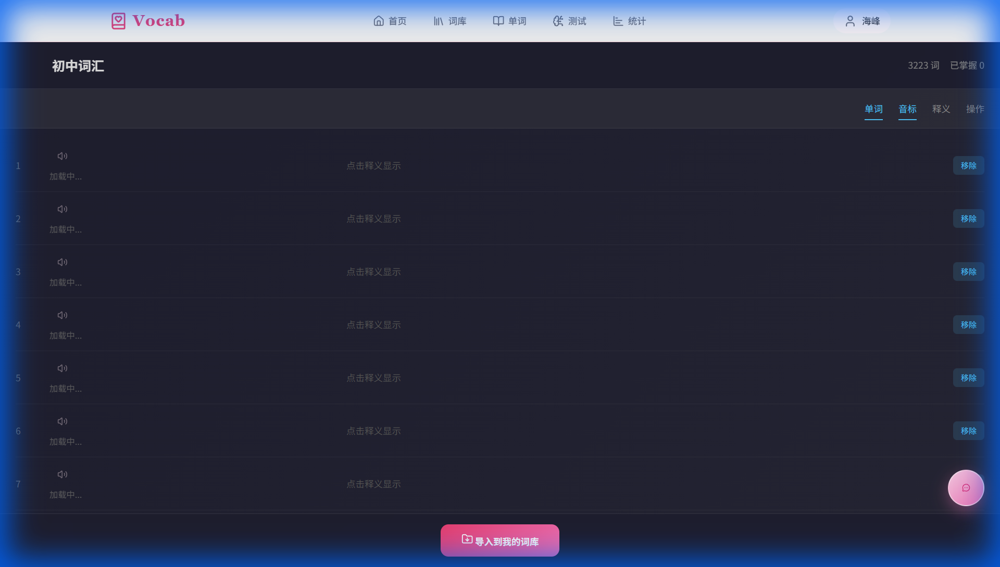

**说明**：词库学习页面，展示选中词库的单词列表，支持隐藏释义进行自测，点击显示按钮可查看答案，实现高效的记忆学习。

---

## 6.2 测试与统计模块（成员B）

### 6.2.1 测试设置界面
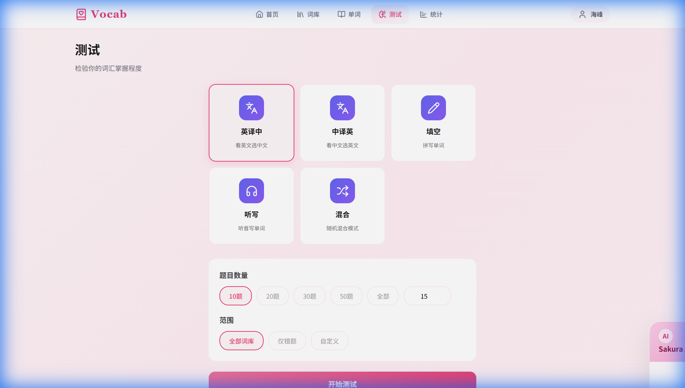

**说明**：测试设置页面，提供四种测试模式选择：英译中、中译英、填空题、听写测试。用户可设置题目数量和是否仅测试错题。

### 6.2.2 测试进行中界面
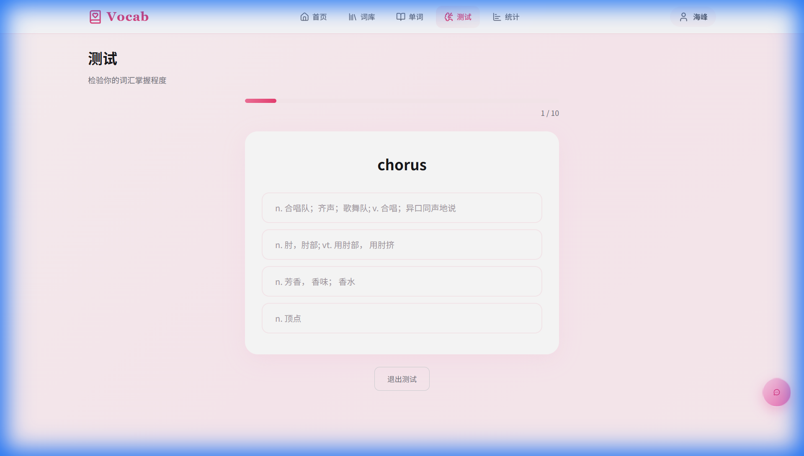

**说明**：英译中测试进行界面，显示当前题号/总题数、英文单词，用户需从四个选项中选择正确的中文释义。

### 6.2.3 测试结果界面
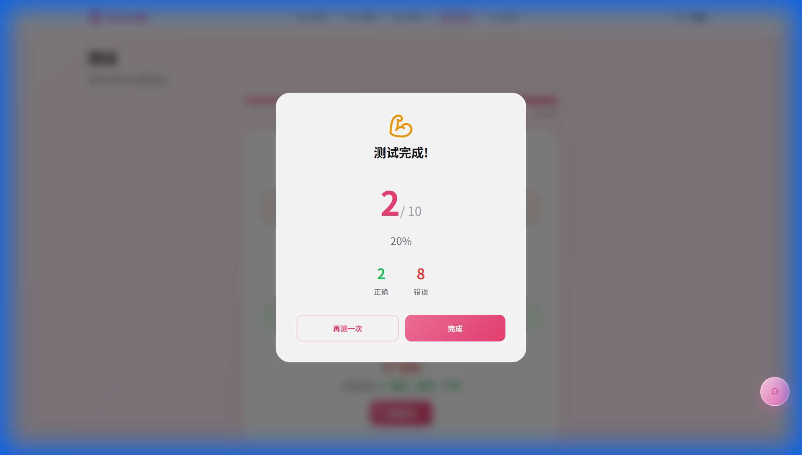

**说明**：测试完成后的结果页面，展示本次测试的得分、正确率、正确题数和错误题数，帮助用户了解学习效果。

### 6.2.4 错题本界面
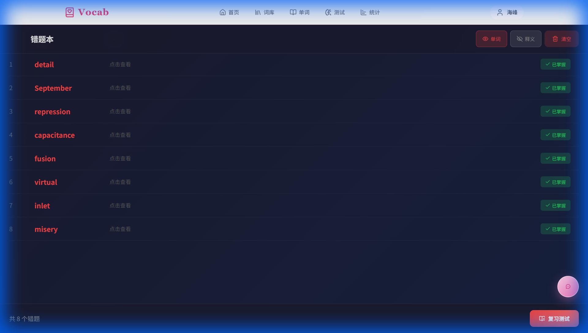

**说明**：错题本页面，记录用户在测试中答错的单词，显示单词、释义和掌握状态。支持复习和删除功能，帮助用户巩固薄弱知识点。

### 6.2.5 学习统计界面

**说明**：学习统计页面，展示总单词量、已掌握/学习中/待学习的分布饼图、近7天学习趋势折线图，以及数据导出功能（支持CSV、JSON和学习报告）。

---

## 6.3 用户交互与系统模块（成员C）

### 6.3.1 登录界面
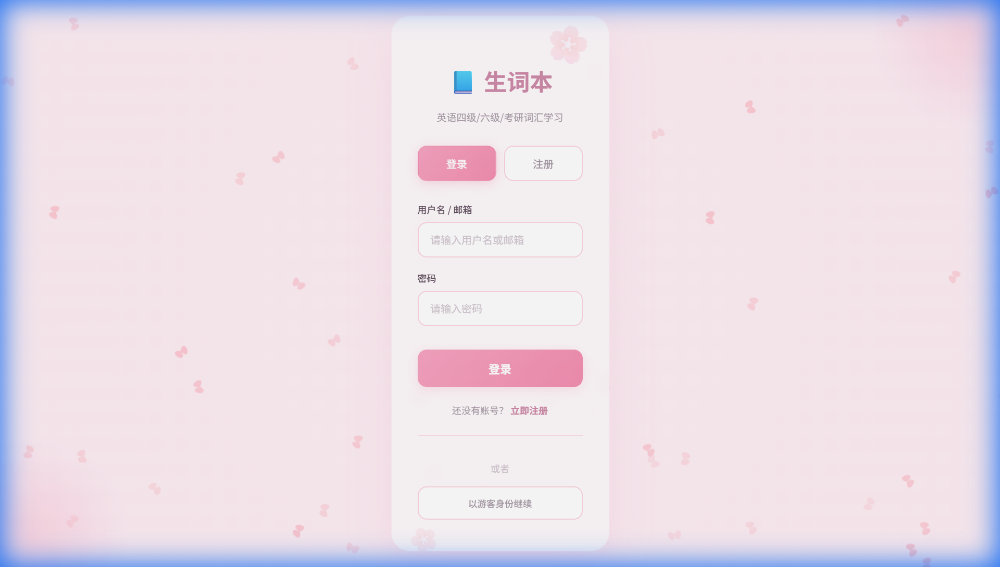

**说明**：系统登录界面，采用樱花主题设计，支持用户名/邮箱和密码登录。提供注册入口和游客模式选项。

### 6.3.2 注册界面
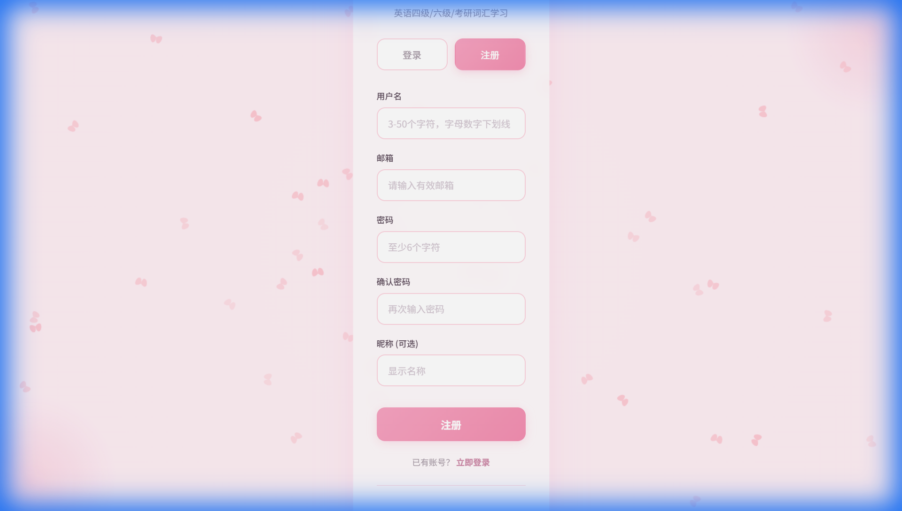

**说明**：用户注册界面，需要填写用户名、邮箱、密码和确认密码，可选填昵称。注册成功后自动登录。

### 6.3.3 首页仪表盘
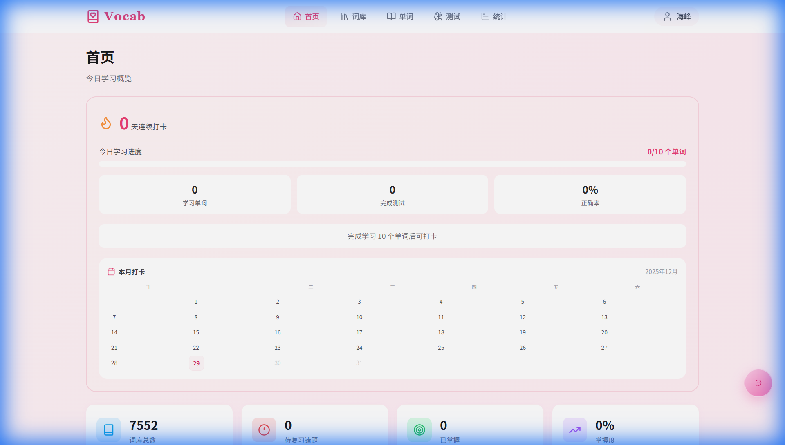

**说明**：系统首页仪表盘，展示今日学习进度、统计概览（总单词/已掌握/学习中/待学习）、本月打卡日历和快速功能入口。

### 6.3.4 AI助手界面
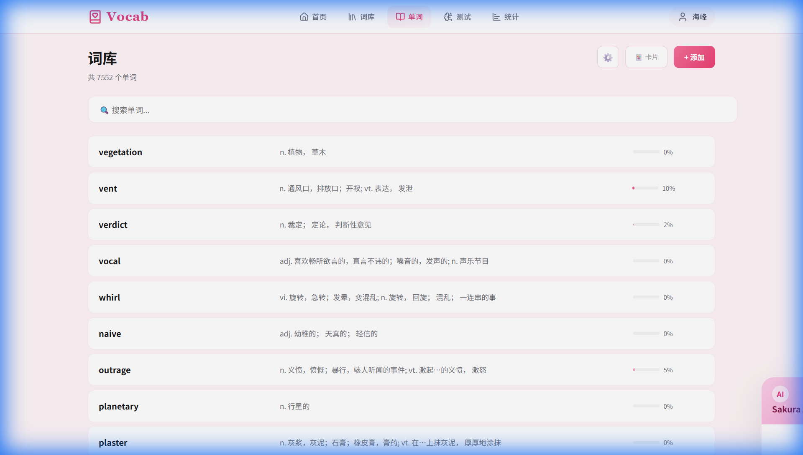

**说明**：AI学习助手界面（Sakura），位于页面右下角悬浮按钮。支持智能对话，可提供单词讲解、学习建议和语法解析等功能。

### 6.3.5 设置界面
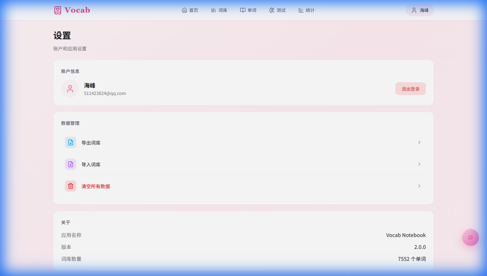

**说明**：系统设置页面，展示用户基本信息（头像、昵称、邮箱），提供数据管理功能（导入/导出/清除数据）和退出登录按钮。

---

## 📁 截图文件清单

| 模块 | 文件名 | 说明 |
|------|--------|------|
| 6.1 | `library_center_page_1766973318848.png` | 词库中心 |
| 6.1 | `vocabulary_card_view_1766973207459.png` | 生词本卡片视图 |
| 6.1 | `vocabulary_list_view_1766973228276.png` | 生词本列表视图 |
| 6.1 | `add_word_dialog_1766973617129.png` | 添加单词弹窗 |
| 6.1 | `batch_add_view_1766973645735.png` | 批量添加界面 |
| 6.1 | `study_page_1766973575371.png` | 学习页面 |
| 6.2 | `quiz_settings_page_1766973287409.png` | 测试设置 |
| 6.2 | `quiz_in_progress_1766973392010.png` | 测试进行中 |
| 6.2 | `quiz_results_1766973474686.png` | 测试结果 |
| 6.2 | `wrong_questions_list_1766973546207.png` | 错题本 |
| 6.2 | `statistics_page_1766973158188.png` | 学习统计 |
| 6.3 | `login_page_1766973032213.png` | 登录页面 |
| 6.3 | `registration_page_1766973053000.png` | 注册页面 |
| 6.3 | `dashboard_overview_1766973130032.png` | 首页仪表盘 |
| 6.3 | `ai_assistant_interface_1766973256791.png` | AI助手 |
| 6.3 | `settings_page_1766973182775.png` | 设置页面 |
