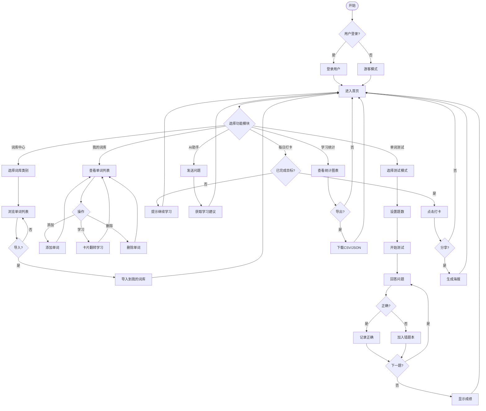
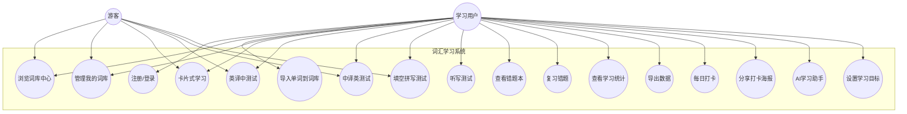
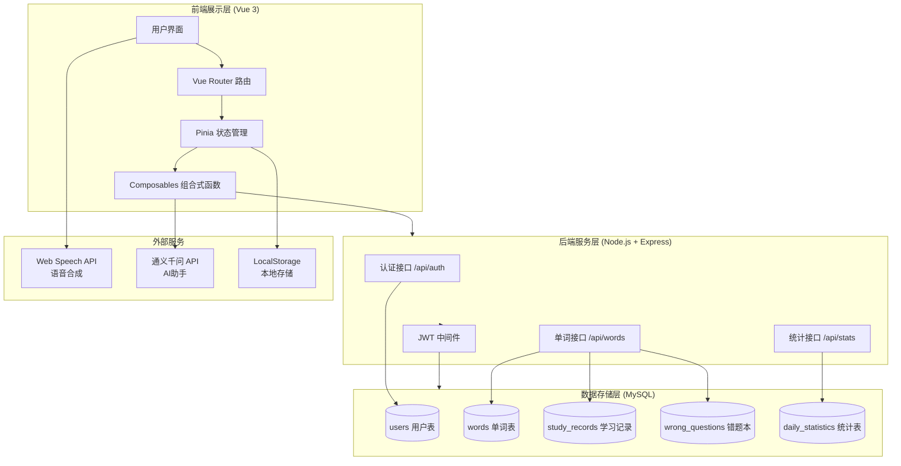

# 3. 系统需求分析

**负责人：[填写姓名]**

---

## 3.1 业务需求分析

### 业务流程图（活动图）

---

## 3.2 用户需求分析

### （1）用例图

---

### （2）用例解说

| 用例编号 | 用例名称 | 参与者 | 前置条件 | 基本流程 | 备注 |
|---------|---------|--------|----------|----------|------|
| UC1 | 注册/登录 | 用户 | 无 | 输入用户名密码→验证→进入系统 | 支持游客模式 |
| UC2 | 浏览词库中心 | 用户/游客 | 进入系统 | 选择词库类别→查看单词列表 | 内置初中/高中/四六级/考研词库 |
| UC3 | 导入单词到词库 | 用户 | 已浏览词库 | 选择单词→点击导入→确认 | 自动去重 |
| UC4 | 管理我的词库 | 用户/游客 | 已有单词 | 添加/删除/查看单词 | 支持批量添加 |
| UC5 | 卡片式学习 | 用户/游客 | 词库有单词 | 查看单词→翻转卡片→查看释义 | 支持发音 |
| UC6 | 英译中测试 | 用户/游客 | 词库≥4个单词 | 看英文→选中文释义 | 4选1选择题 |
| UC7 | 中译英测试 | 用户/游客 | 词库≥4个单词 | 看中文→选英文单词 | 4选1选择题 |
| UC8 | 填空拼写测试 | 用户/游客 | 词库≥1个单词 | 看释义→拼写单词 | 显示首字母提示 |
| UC9 | 听写测试 | 用户/游客 | 词库≥1个单词 | 听发音→拼写单词 | 可重复播放 |
| UC10 | 查看错题本 | 用户/游客 | 有错题记录 | 查看错误单词列表 | 可标记已掌握 |
| UC11 | 复习错题 | 用户/游客 | 有错题记录 | 针对错题进行测试 | 强化薄弱环节 |
| UC12 | 查看学习统计 | 用户/游客 | 有学习记录 | 查看饼图/折线图 | 显示掌握程度分布 |
| UC13 | 导出数据 | 用户/游客 | 有数据 | 选择格式→下载文件 | 支持CSV/JSON/报告 |
| UC14 | 每日打卡 | 用户/游客 | 完成每日目标 | 点击打卡→记录 | 显示连续天数 |
| UC15 | 分享打卡海报 | 用户/游客 | 已打卡 | 生成海报→保存/分享 | Canvas生成图片 |
| UC16 | AI学习助手 | 用户 | 已登录 | 发送问题→获取建议 | 调用通义千问API |
| UC17 | 设置学习目标 | 用户/游客 | 进入系统 | 设置每日单词数 | 默认10个/天 |

---

## 3.3 系统总体架构图

### 技术栈说明

| 层次 | 技术 | 说明 |
|------|------|------|
| **前端** | Vue 3 + Vite | 响应式用户界面 |
| **状态管理** | Pinia | 全局状态管理 |
| **路由** | Vue Router 4 | SPA路由控制 |
| **后端** | Node.js + Express | RESTful API服务 |
| **数据库** | MySQL 8.0 | 关系型数据存储 |
| **认证** | JWT (JSON Web Token) | 用户身份验证 |
| **语音** | Web Speech API | 单词发音功能 |
| **AI** | 通义千问 (DashScope) | AI学习建议 |
